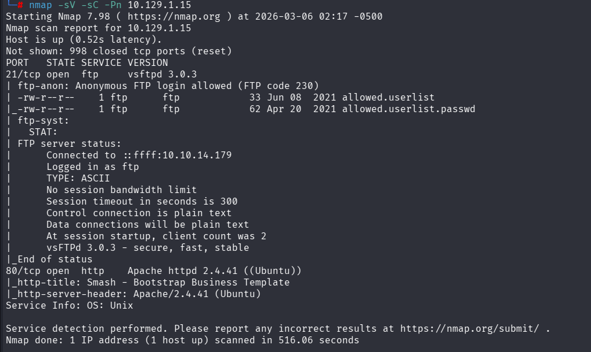
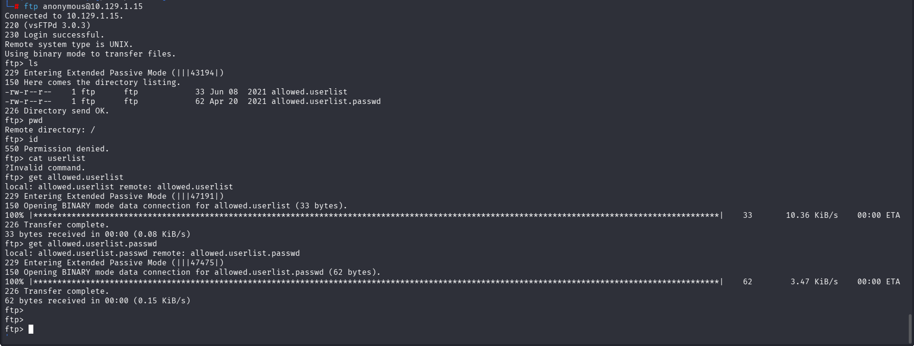
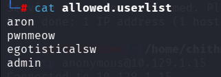
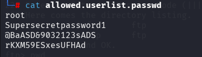
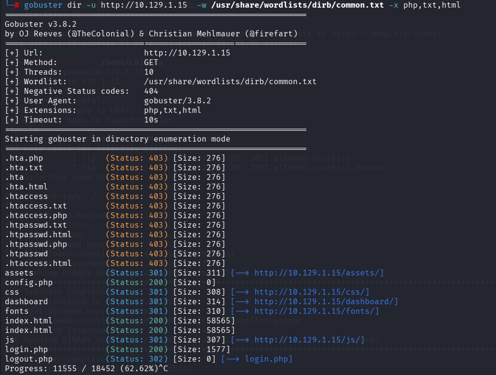

"namp -sV -sC  <IP address> -x "
-sV => Service Version Detection
-sC => Default Script Scan
-x  => Used in Gobuster to specify file extensions

download username file and password file 

 
use this login.php in the url and it will give a login page and use the admin credentials to access to the admin's account and it will show the flag
