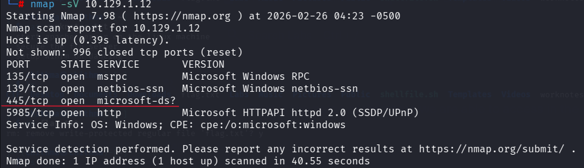
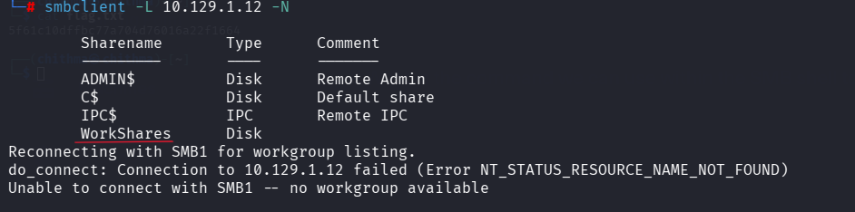
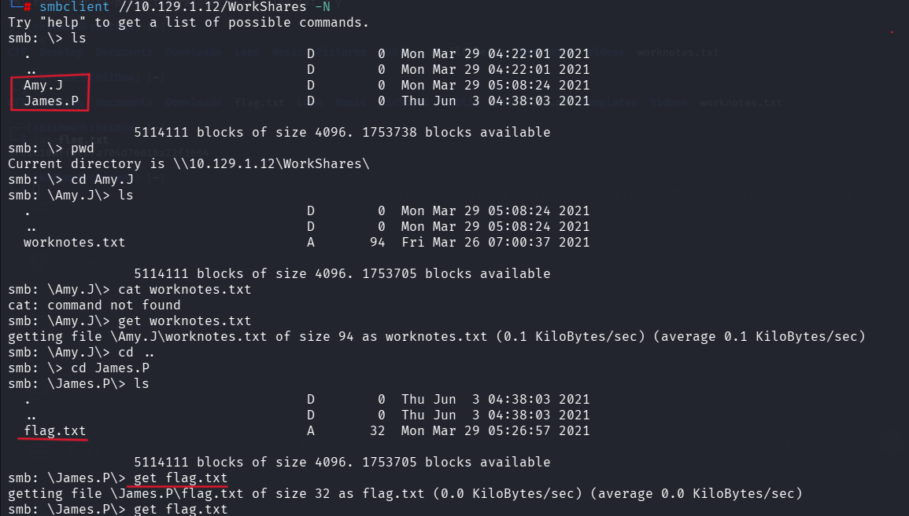

# HackTheBox -DANCING

## Basic Info
- Platform: Hack The Box
- Difficulty: Very Easy
- Date solved: 26-02-2026

## Enumeration
- Nmap scan: `nmap -sV <IP>`
- Open ports: 135,139,445,5985
- Services found: MSRPC, NetBIOS, SMB, WinRM

- Ports 139 and 445 indicate SMB service is running
- Port 5985 indicates WinRM (Windows Remote Management)
- Target OS confirmed as Windows
Since SMB is available, we proceed with SMB enumeration.

- ADMIN$ → Administrative share
- C$ → Default administrative share
- IPC$ → Interprocess communication
- WorkShares → Custom share (interesting!)
We focus on WorkShares.

## Key Takeaways

- SMB allowed anonymous access
- Sensitive files were accessible without authentication
- Always enumerate:
-- Public shares
-- User directories
-- Text files for credentials or flags

## Security Lessons

From a defensive perspective:
- Disable anonymous SMB access
- Restrict share permissions
- Monitor SMB access logs
- Avoid storing sensitive information in shared directories

## Tools Used

- Nmap – Network scanning & service detection
- SMBClient – SMB enumeration and file retrieval
