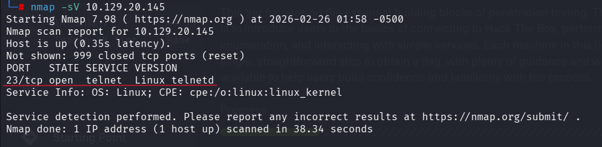
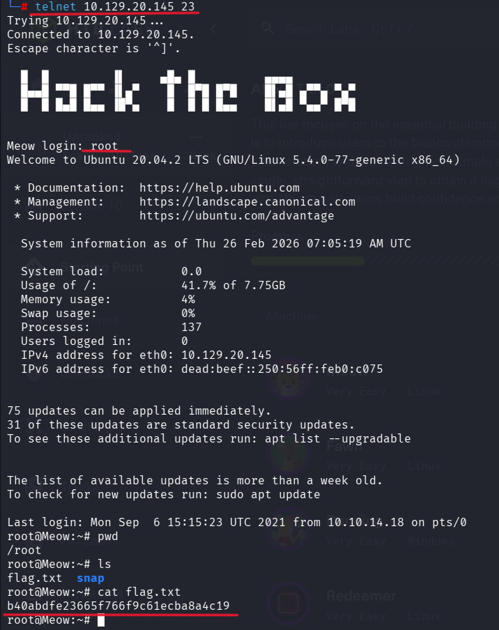

# HackTheBox - MEAW

## Basic Info
- Platform: Hack The Box
- Difficulty: Very Easy
- Date solved: 26-02-2026

## Enumeration
- Nmap scan: `nmap -sV <IP>`
- Open ports: 23
- Services found: telnet
  
## Nmap Scan

This indicates the machine allows remote login via Telnet.

## Initial Foothold
Since Telnet was open, I attempted to connect:
-telnet 10.129.20.145 23

## Privilege Escalation
-Method: Not required
-Reason: Direct root access via Telnet

The Telnet service allowed direct root login, so the machine was already fully compromised.

## Flags
-User flag: N/A
-Root flag: b40abdfe23665f766f9c61ecba8a4c19

## What I Learned
-Always check all open ports carefully.
-Telnet is insecure and should not allow root login.
-Some beginner machines test basic service enumeration.
-Even a single open port can be enough to fully compromise a system.
-Try default or common usernames when services allow authentication.

