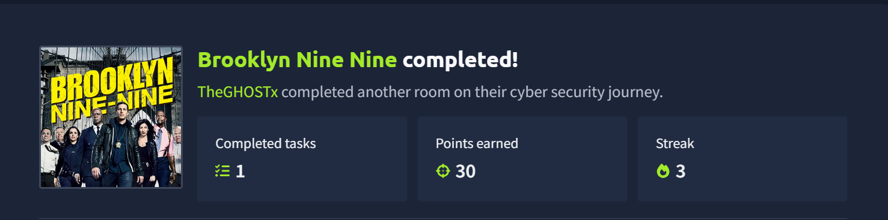
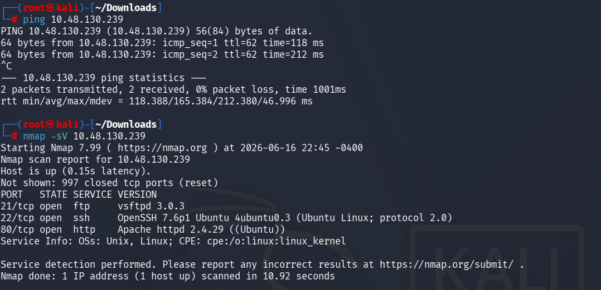
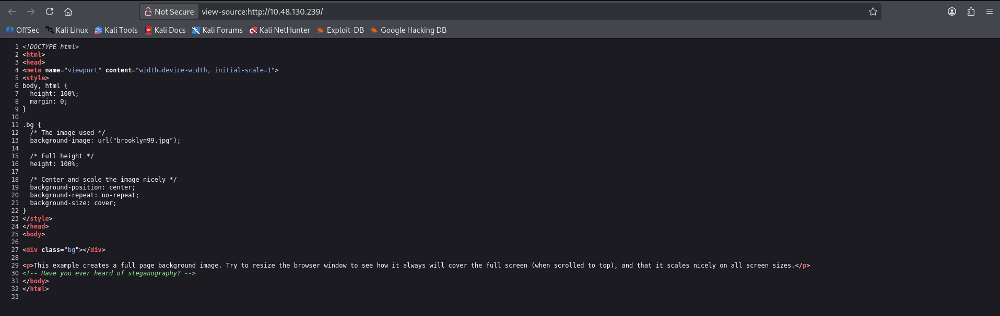
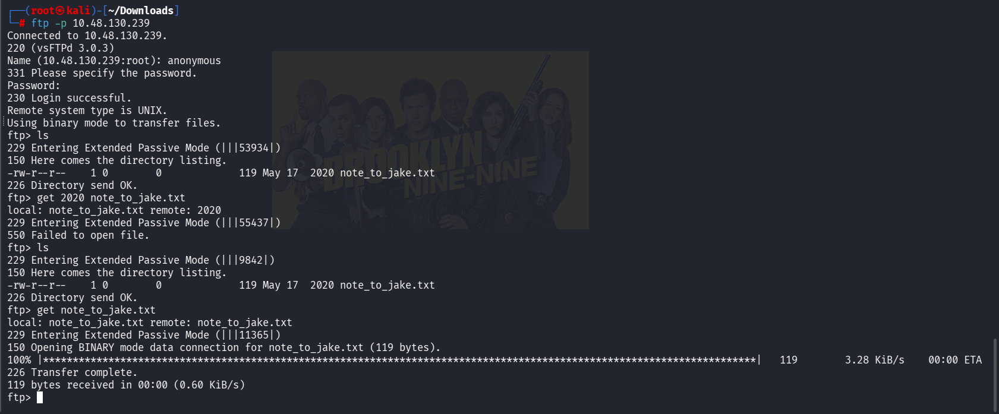
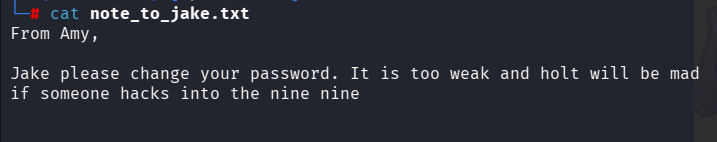
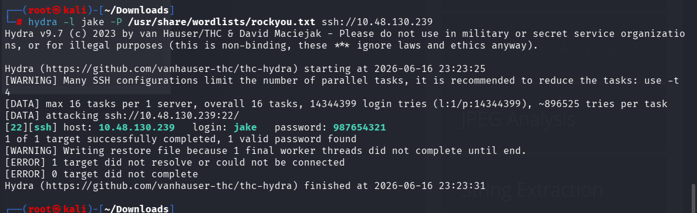
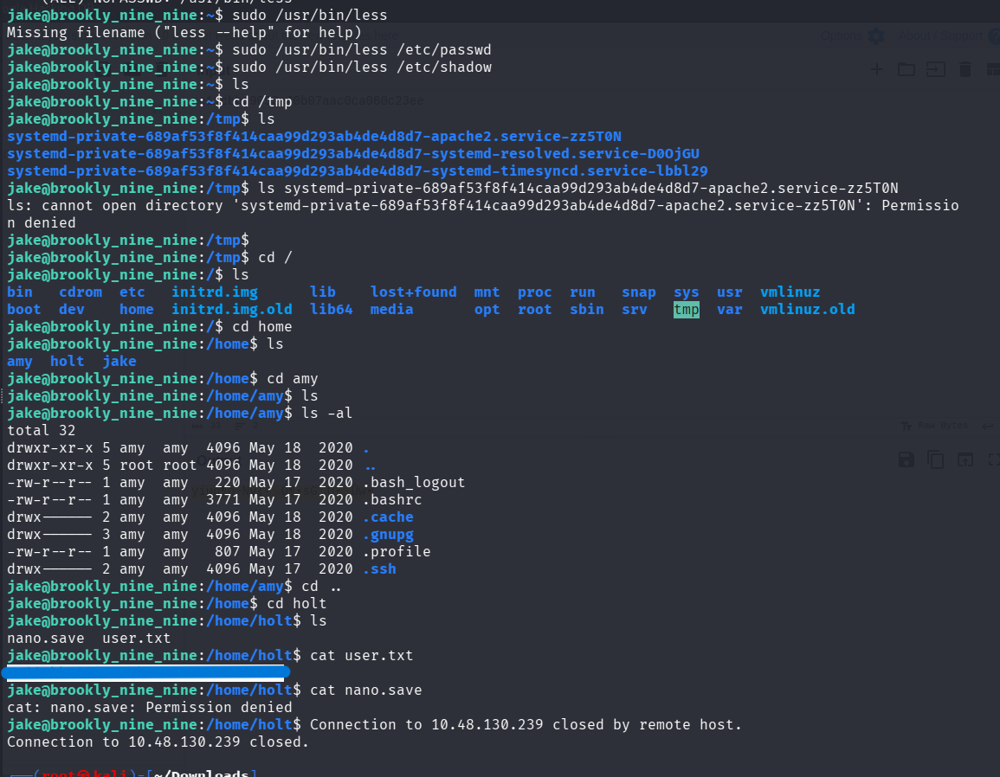
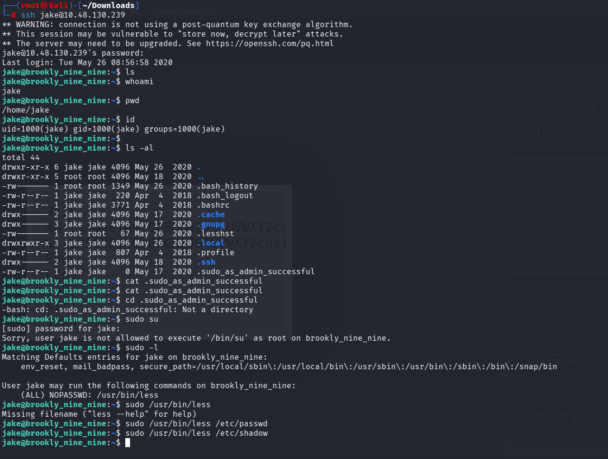
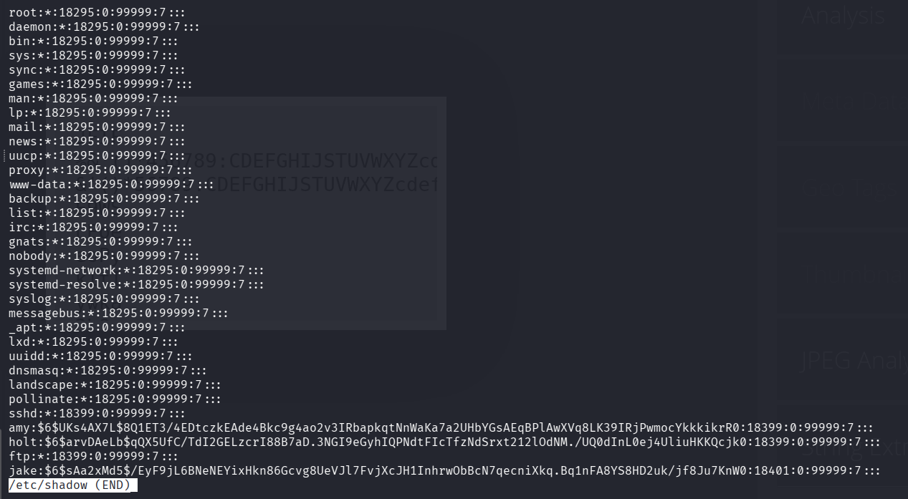
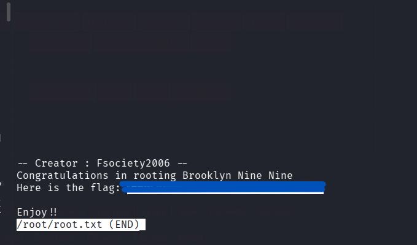

# Brooklyn Nine Nine

Objective: Obtain the user and root flags.

## 1.Reconnaissance & Enumeration
### Network Scanning

We began by sending an ICMP request to verify the host was up, followed by a service version scan using nmap as shown in Brooklyn Nine Nine9.png:

Bash:
- ping 10.48.130.239
- nmap -sV 10.48.130.239
- 
The scan revealed three open ports:
- Port 21: FTP (vsftpd 3.0.3)
- Port 22: SSH (OpenSSH 7.6p1)
- Port 80: HTTP (Apache httpd 2.4.29)

### Web Footprinting

Navigating to the web application on port 80, we viewed the page source as captured in Brooklyn Nine Nine8.png. A hidden HTML comment dropped a massive hint:
      "Have you ever heard of steganography?"
      

The page also loads a background image (brooklyn99.jpg). This indicates potential steganography vectors to extract hidden data/credentials later if needed.

## 2.Initial Access & Foothold

### FTP Anonymous Login

Knowing port 21 is open, we attempted an anonymous login (anonymous:anonymous) as documented in Brooklyn Nine Nine7.png. The login was successful, exposing a note left on the server:

Reading note_to_jake.txt (Brooklyn Nine Nine6.png), we found a message from Amy warning Jake about his weak password:

"Jake please change your password. It is too weak and holt will be mad if someone hacks into the nine nine"

### SSH Brute Forcing

Armed with a target username (jake) and the knowledge that his password is weak, we deployed hydra using the standard rockyou.txt wordlist (Brooklyn Nine Nine5.png):

"hydra -l jake -P /usr/share/wordlists/rockyou.txt ssh://10.48.130.239"

Hydra successfully cracked the password in seconds:
- Username: jake
- Password: 987654321

## 3.Post-Exploitation & Lateral Movement

### System Enumeration

We established an SSH session using the cracked credentials (Brooklyn Nine Nine3.png)
Bash:
  "ssh jake@10.48.130.239"
  
Checking our environment, we explored the /home directory to find three user profiles: amy, holt, and jake. Navigating into /home/holt, we uncovered the first flag (Brooklyn Nine Nine2.png):

Bash:
 - cd /home/holt
 - cat user.txt
   

## 4. Privilege Escalation

### Sudo Rights Exploitation

To escalate to root, we checked Jake's current sudo privileges using sudo -l (Brooklyn Nine Nine3.png):

Bash:
  "sudo -l"
  
The output revealed an entry allowing Jake to run less with root privileges without a password:
Plaintext
User jake may run the following commands on brookly_nine_nine:
    "(ALL) NOPASSWD: /usr/bin/less"
    
### Breaking Out of Less

Using an exploitation technique from GTFOBins, we spawned an interactive shell straight from the less binary interface.

Execute less on any readable system file with sudo:

