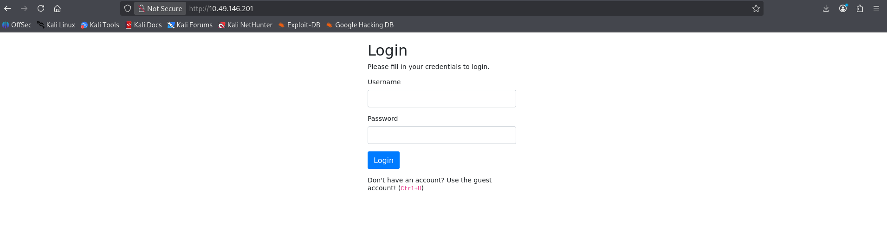

## Neighbor

# Challenge Overview

- Category: Web Exploitation
- Difficulty: Easy
- Objective: Access the forbidden admin account profile to retrieve the flag.

## Step 1: Initial Enumeration & Source Code Inspection

Upon navigating to the target IP address, we are greeted with a standard login page. The page hints at viewing the source code by referencing Ctrl+U.

- Open the target URL http://10.49.146.201 in your browser.
- View the HTML source code of the page (view-source:http://10.49.146.201/).

Looking closely at the comments inside the HTML source, a developer note reveals valid credentials and explicitly warns that the administrative account is off-limits:

