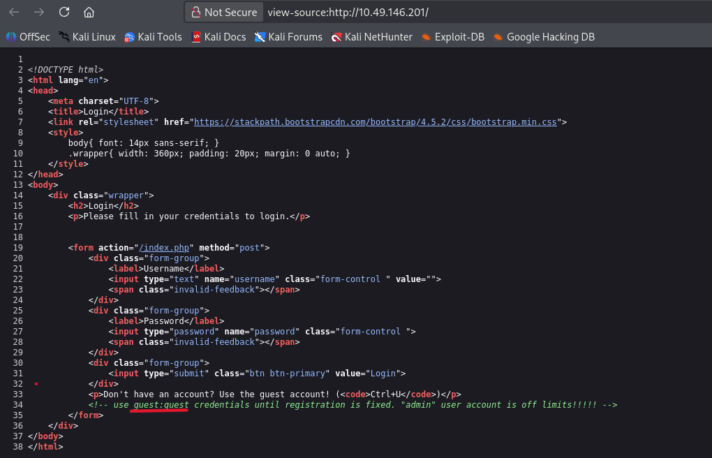
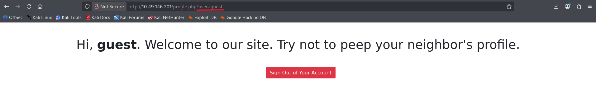
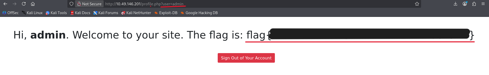

## Neighbor

# Challenge Overview

- Category: Web Exploitation
- Difficulty: Easy
- Objective: Access the forbidden admin account profile to retrieve the flag.

## Step 1: Initial Enumeration & Source Code Inspection

Upon navigating to the target IP address, we are greeted with a standard login page. The page hints at viewing the source code by referencing Ctrl+U.

- Open the target URL http://10.49.146.201 in your browser.
- View the HTML source code of the page (view-source:http://10.49.146.201/).

Looking closely at the comments inside the HTML source, a developer note reveals valid credentials and explicitly warns that the administrative account is off-limits:

The initial web login portal directing users to check the source code.

Viewing the page source code exposes a hidden comment containing guest credentials and a mention of an "admin" user.

## Step 2: Accessing the Guest Account

Using the leaked credentials discovered in the source code comments, we can log into the application to observe how the profile session is handled.

- Return to the login portal.
- Enter the username guest and the password guest.
- Click Login.

Once logged in, the application redirects us to a profile page: 
http://10.49.146.201/profile.php?user=guest. The page displays the message: "Hi, guest. Welcome to our site. Try not to peep your neighbor's profile." The URL path directly exposes a query parameter (?user=guest), strongly indicating an IDOR (Insecure Direct Object Reference) vulnerability.

Successfully logged in as the guest user, revealing the vulnerable URL parameter.

## Step 3: Exploiting the IDOR Vulnerability to Retrieve the Flag

Since the application relies entirely on the client-side URL parameter to determine which profile to fetch—and based on the comment we found in Step 1 mentioning an admin user—we can manipulate the parameter to access the restricted administrative panel.

- Navigate to the URL bar.
- Modify the user parameter from guest to admin.
- Press Enter to request the updated URL: http://10.49.146.201/profile.php?user=admin

The application fails to perform proper server-side authorization checks, granting full access to the administrator's profile and revealing the flag.

Manipulating the URL parameter to 'admin' bypasses authorization and reveals the hidden flag.
