# MADNESS
## Basic Info
- Platform: Try Hack Me
- Difficulty: Easy
- Date solved: 01-03-2026

## Enumeration
- Nmap scan: nmap -sV <IP>
- Open ports: 22, 80
- Services found: ssh, http
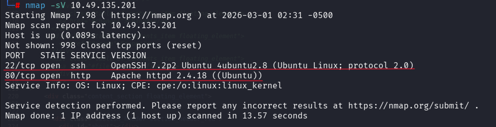

by going in to the sourcecode of the website I sow a image call thm.jpg
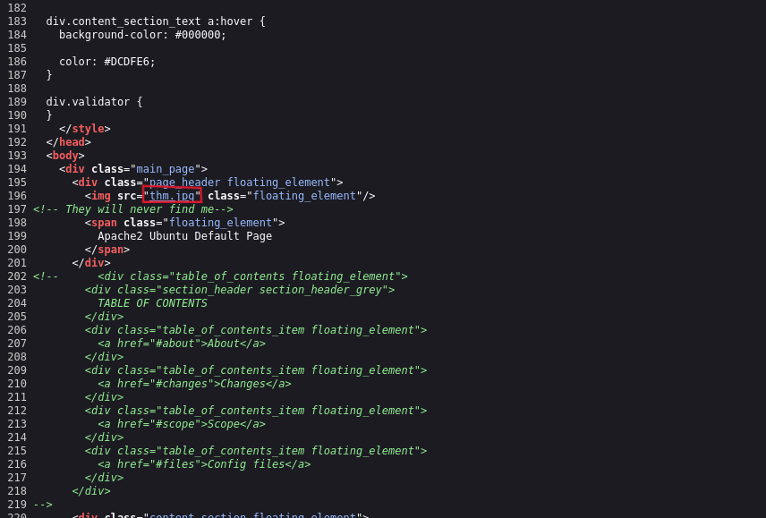

got that image using the following command
curl -o <file name> "<URL>"

use xxd tool to check the file is a jpg file or not and found that the file is actually a png file by looking at the hexadecimal header. this shows the header as 8950 4e47 but this header is refer to png files jpg should have the header of 
FF D8 FF

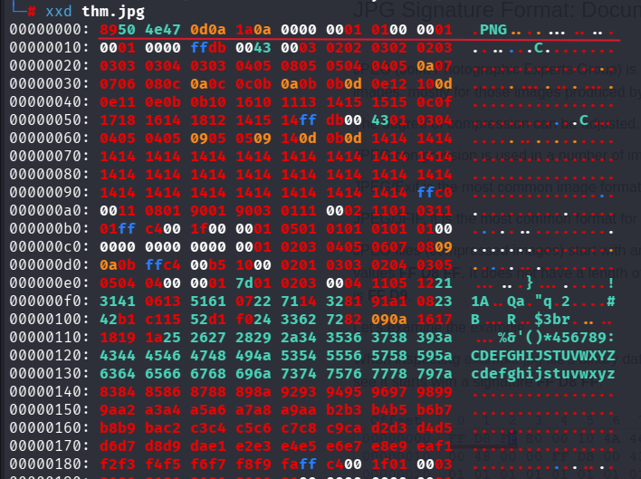

now we want to change the header to open the file to a jpg or JFIF to do further investigation.

we can u the following command to get the editable file.
- hexedit <filename>

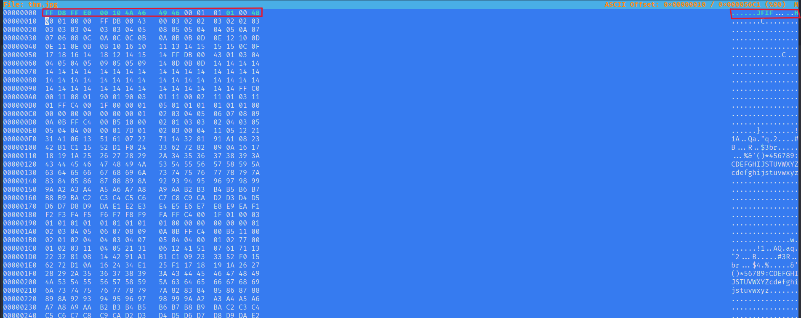
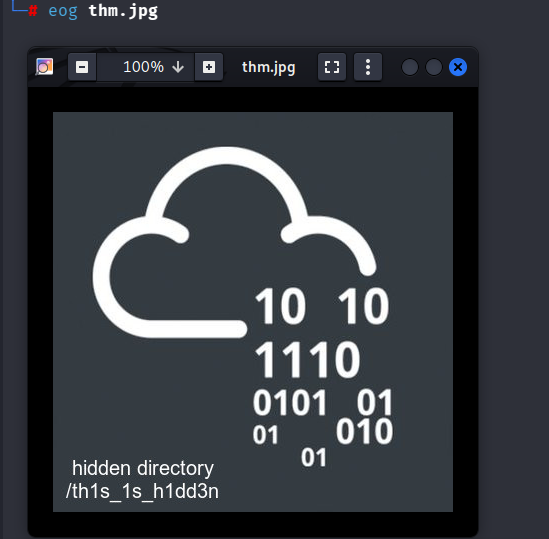
 then after run "eog" command to opent the image. in the image i got a part of a url that is "th1s 1s h1dd3n". then i types that part in the URL and got a new web page that asking for a secret code. and checked the source code and found a hint saying the secreat code is between 1 and 100. then i type the following code.
 

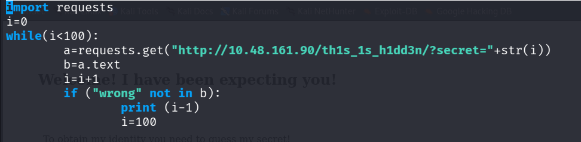

the above python code run by typing "Python3 <file name>" then it gave the output as 73 which is the secret code. then used the secret code to get accessto the website using following url

http://<ip address>/th1s_1s_h1dd3n/?secret=73

this gave to access and displayed the following sentance tat shows in the screenshot. and it gives a unknown letters I assumed that is a password.
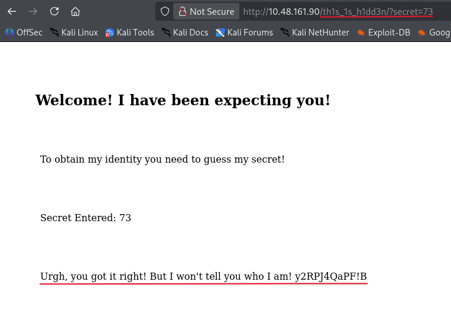

then I tried "steghide extract -sf thm.jpg" to extract any files in the thm.jpg image and it asked for a password and I wrot that unknown word as the password and it extract a file call hidden.txt. its content shows in the following screenshot.

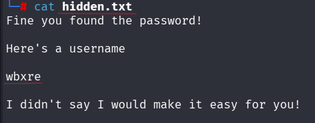

this also has a encrypted word that is a username of something. then I decrypt this word using ROT13 and found a name call "joker" that might be the username of the ssh.
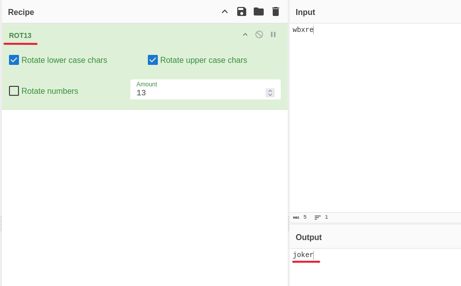 

Now you found the username of the ssh nd need to find the password for that. There for i save the image in the tryhackme website to the kali machine. then i tried "steghide extract -sf <file name>" command on that image also and it asked for a password and just hit enter and i extracted a txt file. that includes the password and using those credentials i logged in to the ssh by running following command. 
"ssh joker@<ipaddress>"

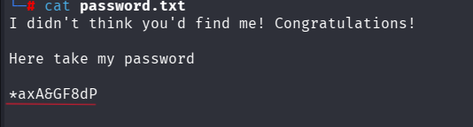 
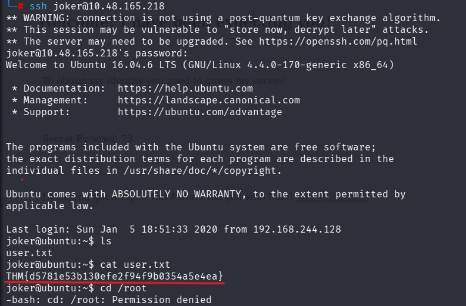

after got the user access there is a user.txt file and inside that file I found the User flag.

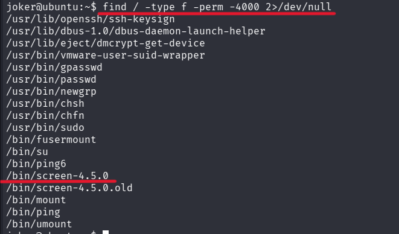
to get the root access i usded SUID. the following command shows that.
"find / -type f -perm -4000 2>/dev/null"
Search the entire system for regular files that have the SUID bit set, and hide any permission errors.

from this i found a unknown thing call screen 4.5.0

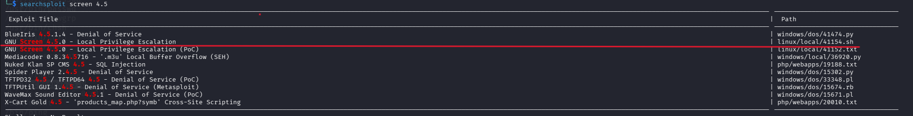
found the explain from the searchsploit and coppy the sh code and create a sh file in the victim mechine and paste it there.
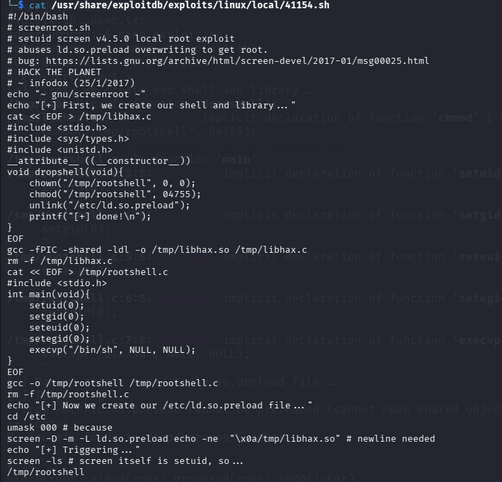

then execute it and run the exploit and instantly got the root access.
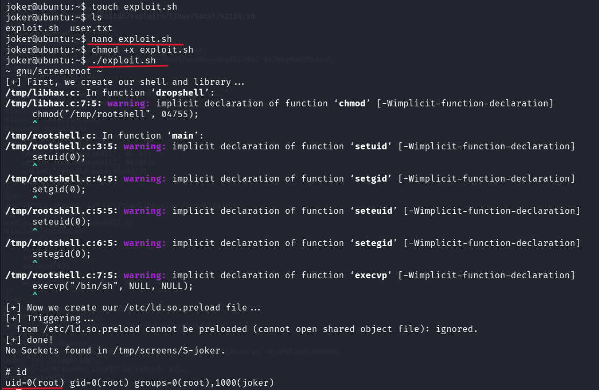
to confirm it run id and check

 then move to the root directory and found the final flag.
 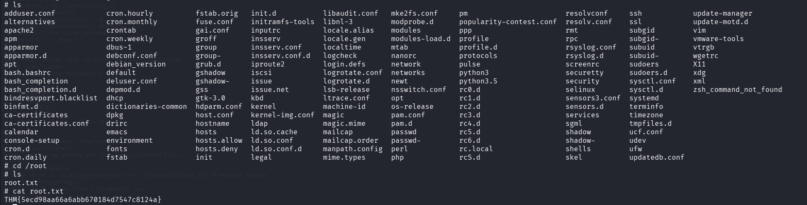
